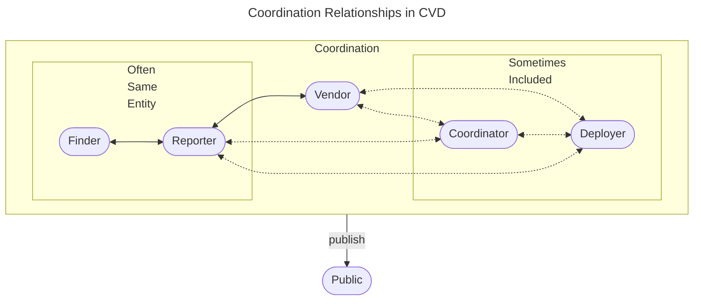

# Vunerability disclosure process for Decent community

This repo contains proposals for a vunerability disclosure process for the Decent community.
All content within this repo does not currently reflect official ideas or policies of Decent Espresso
nor it is currently supported or approved by Decent Espresso.

## Models of vunerability disclosure

### Private Disclosure

Vulnerability is reported privately to the organization. The organization decides whether to publish the details.
This is common in bug bounty programs.
<https://cheatsheetseries.owasp.org/cheatsheets/Vulnerability_Disclosure_Cheat_Sheet.html#private-disclosure>

### Full Disclosure

Full details of the vulnerability are made public immediately after discovery. This approach can pressure organizations
to fix the vulnerability quickly but can also expose users to potential attacks.
<https://cheatsheetseries.owasp.org/cheatsheets/Vulnerability_Disclosure_Cheat_Sheet.html#full-disclosure>

### Responsible or Coordinated Disclosure

Middle ground where the vulnerability is initially reported privately, and the details are made public only after a patch
is available. This allows time for the organization to fix the issue before it becomes public knowledge.
<https://certcc.github.io/CERT-Guide-to-CVD/>

## Roles and stakeholders

CVD roles from <https://certcc.github.io/CERT-Guide-to-CVD/tutorials/cvd_in_a_nutshell/#relationships-between-roles>

## References and related

<https://github.com/microsoft/onnxruntime/blob/main/SECURITY.md>  
