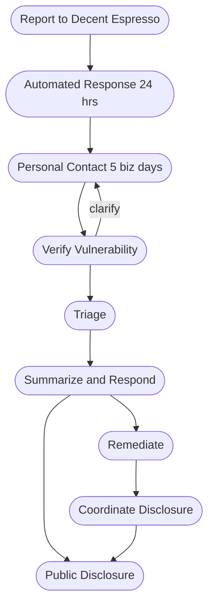

# Security Vulnerability Reporting and Disclosure

[Decent Espresso](https://decentespresso.com/) strives to provide safe and secure products and services.
We prefer a [responsible coordinated disclosure](https://certcc.github.io/CERT-Guide-to-CVD/tutorials/cvd_in_a_nutshell/)
of security vulnerabilities.

We appreciate your effort to reduce harm to our customers and systems. We commit to decent and timely communication. We also commit to no punitive action against you when using our responsible coordinated disclosure approach.

## Reporting

We prefer you report the vulnerability privately to us before public disclosure.
Please report it to us by sending an email to [security@decentespresso.com](mailto:security@decentespresso.com).

We request you include, when possible, the following information to help us understand the issue:

* Brief description of the vulnerability
* Impact (e.g. data loss, unauthorized access, equipment failure, physical harm, etc.)
* Affected models or versions, configuration, setup
* Detailed steps to reproduce the vulnerability
* Evidence of the vulnerability (e.g. screenshots, logs, etc.)
* Expected secure behavior
* Proof of concept or exploit code (if applicable) in a ZIP file, private git repository, etc.
* Your contact information (email, phone number, etc.)

You may encrypt your email or file attachments using our
[#PGP public key url here#](https://decentespresso.com/xxxxxxxx-Public-Key.asc).

We prefer security vunerability communication in English.

## Investigation, triage, remediation, disclosure

1. We will send you an automated response within 24 hours acknowledging receipt of your email report.
   If this fails, please resend your email or [use another method](https://decentespresso.com/support/).
2. We will personally contact you to verify the vulnerability within 5 business days.
   We ask for your patience since we may need additional information or clarification.
3. We will keep you informed of our triage progress with decent timelines.
4. After triage, we will provide you with a summary of the vulnerability and our response.
5. When triage approves remediation, we will do so in a timely manner while keeping you informed.
6. We will work with you to coordinate the public disclosure of the vulnerability after remediation is available.
7. We will acknowledge your contributions in our public disclosure.
   We will respect your privacy and anonymity if you request it.

## Flowchart

## Bug bounty

We do not at this time offer a bug bounty program.
We appreciate your responsible disclosure of security vulnerabilities.
